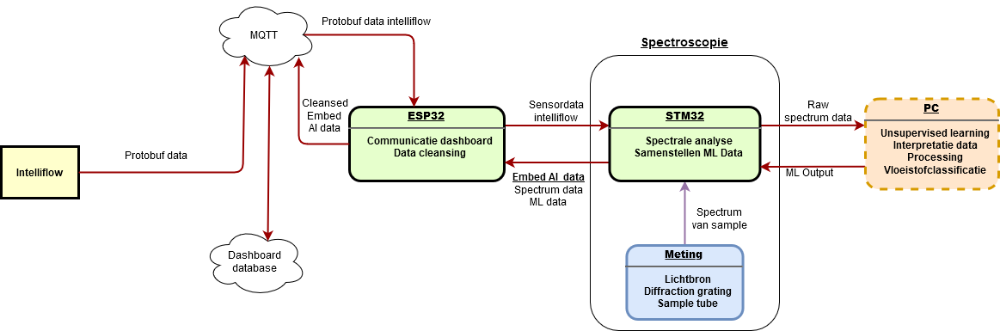

# EMBEDDED AI REPO

# Vloeistofdetectie met VIS spectroscopie en embedded vision

## Beknopte uitleg indeling github

Op deze github pagina staan alle bestanden van Embed AI. Deze bestanden zijn geordend in mappen. Het ESP32 gedeelte bevindt zich in de [ESP32 firmware map](https://github.com/PXL-Embedded-AI/repo/tree/master/ESP32/firmware). De flowchart is terug te vinden in de [flowchart](https://github.com/PXL-Embedded-AI/repo/blob/master/Flowchart/flowchart-embeddedAI.png) map, etc. 

De kern van het onderzoek is terug te vinden in de [Spectroscopy folder](https://github.com/PXL-Embedded-AI/repo/tree/master/Spectroscopy). Hierin staat alle info en staan alle bestanden omtrent de diffractieroosters, implementatie, software voor de openMV camera (van de spectroscoop), en de theorie van spectroscopie.


## Blokschema

<p align="center"></p>

## Spectroscopie theorie

De theorie van spectroscopie is [hier](./Spectroscopy/Theory/Spectroscopy.pdf) terug te vinden. Deze volstaat om een basic spectroscoop te realiseren.

## Spectroscoop constructie

### Benodigdheden
| Component           | # | Beschrijving                                          | Fabrikant | Price p. st. [euro] |   
|---------------------|---|-------------------------------------------------------|-----------|-----------------|
| Schoenendoos        | 1 | Behuizing voor spectroscopie meter.                   | N/A       | N/A             |  
| openMV cam H7 plus  | 1 | Python powered, machine vision module.                | OpenMV    | N/A             |  
| ISY IDV 4100        | 1 | 5x DVD-RW 4.7 GB.                                     | ISY       | [link](https://www.mediamarkt.nl/nl/product/_isy-idv-3000-1282503.html)          |  
| OK spuitlak (zwart) | 2 | Zwarte spuitlak, mat. 400 ml.                         | OK        | [link](https://www.gamma.be/nl/assortiment/ok-spuitlak-hoogglans-wit-400-ml/p/B537279)           | 
| Papier (zwart)      | 1 | Zwart papier.                                         | N/A       | N/A             |  
| MDF plaat 5 mm      | 1 | MDF plaat met 5 mm dikte.                             | N/A       | N/A             |  
| Houten plint        | 1 | Houten plint als drager van de diffraction grating.   | N/A       | N/A             |  
| Boutenset           | 1 | Boutenset 330 stuks schroeven, moeren en sluitringen. | N/A       | [link](https://www.gotron.be/boutenset-330-stuks-philips-schroeven-moeren-sluitringen.html)            |  
| Breadboard          | 1 | Soldeerloos breadboard met 830 gaten -wit.            | EIC       | [link](https://www.gotron.be/meten-solderen/solderen/printplaten/breadboard/soldeerloos-breadboard-met-830-ronde-gaten-wit.html)          | 
| Halogeenlamp        | 1 | G4 10W 12V halogeenlamp.                              | Radium    | [link](https://www.gotron.be/g4-socket-10w-12v-halo-lamp-d-10mm-l-33mm.html)            |  
| Montagedraad set    | 1 | Montagedraad set met vaste kern, 10 m per kleur.      | Ohmeron   | [link](https://www.gotron.be/stijve-montagedraad-set-90m.html)       |  

Voor een volledige beschrijving, [klik hier](./Spectroscopy/Implementation/log.md).

## Installeren open MV IDE

Open MV IDE is vereist om de open MV cam te programmeren. [Download hier](https://openmv.io/pages/download)

## Hardware & software operation

De bekomen spectroscoop moet worden aangesloten op een USB poort van de laptop. De halogeen lamp dient aangesloten te worden aan een 
geschikte voeding tot 12 V en 10 W. 

Het [spectral analysis python script](https://github.com/PXL-Embedded-AI/repo/blob/master/Spectroscopy/OpenMV/SpectralAnalysis.py) zorgt ervoor dat er snapshots van het spectrum genomen worden. De variabele Limit bepaald hoeveel spectra opgenomen worden door de H7 cam.

```
Limit = 10
```
De PC kan de histrogrammen ophalen van elk spectrum met de [JSON read code](https://github.com/PXL-Embedded-AI/repo/blob/master/Spectroscopy/OpenMV/jsonread.py).

### Auteur: Eduardo L. Bemelmans


